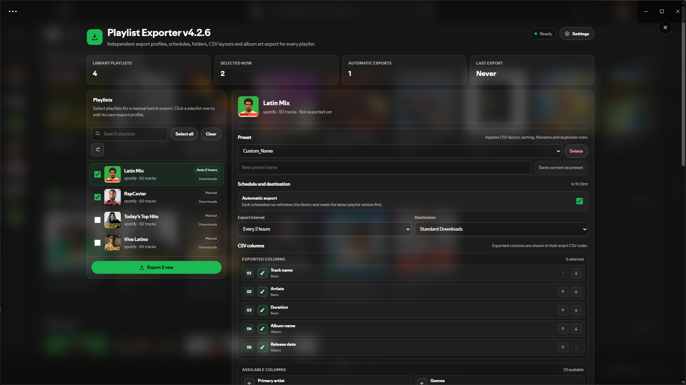

# Playlist Exporter

A Spicetify extension for exporting Spotify playlists to customizable CSV files.



## Features

- Export playlists to CSV
- Choose exactly which metadata columns to include
- Configure export settings individually for each playlist
- Sort tracks and remove duplicates
- Export through browser downloads or directly to a selected folder
- Optionally download album covers
- Schedule automatic exports
- Create reusable export presets
- Keep persistent export history and settings

## Installation

### Spicetify Marketplace

Once published, Playlist Exporter can be installed directly from the Spicetify Marketplace.

### Manual installation

1. Download `playlist-exporter.js`.
2. Copy it to your Spicetify Extensions folder:

```text
%APPDATA%\spicetify\Extensions\
```

3. Run:

```powershell
spicetify config extensions playlist-exporter.js
spicetify apply
```

## Opening Playlist Exporter

After installation, look for the **download-shaped Playlist Exporter button** in Spotify's top bar.

Depending on your Spotify layout or Spicetify theme, the button may appear on the **left or right side of the top bar**.

Click the button to open Playlist Exporter.

You can also open it through:

**Profile picture → Playlist Exporter settings → Open exporter**

## Usage

1. Open Playlist Exporter.
2. Select one or more playlists from the list on the left.
3. Click a playlist to configure its individual export profile.
4. Choose the columns, sorting, duplicate handling, filename and destination you want.
5. Optionally enable automatic exports and choose an interval.
6. Click **Export now**.

Each playlist can keep its own configuration, so different playlists can use different columns, destinations, schedules and presets.

## Settings

There are two ways to open Playlist Exporter settings:

- Click **Settings** in the top-right of the Playlist Exporter interface.
- Open your **Spotify profile picture → Playlist Exporter settings**.

From the Settings page you can:

- View extension information
- Check saved profile and preset information
- See automatic export status
- Access support and feedback links
- Return directly to the main Playlist Exporter interface

## Automatic exports

Automatic exports can be enabled independently for each playlist.

Playlist Exporter periodically checks enabled playlists and exports them according to their configured interval.

Spotify must be running with the extension loaded for scheduled exports to run.

## Export destinations

Playlist Exporter supports:

- **Standard Downloads** — exports through your browser/Spotify download behavior
- **Custom folders** — when supported by your Spotify/Chromium build, you can give Playlist Exporter permission to write directly to a selected folder

Folder permissions are handled locally by the browser environment.

## Privacy

Playlist Exporter does not include telemetry or remote logging.

Your extension settings, playlist profiles, presets and folder permissions are stored locally on your device.

## Contributing

Bug reports and feature suggestions are very welcome through GitHub Issues.

At the moment, I'm not actively accepting pull requests, mainly so I can keep the project manageable and avoid changes I don't have enough time to review properly.

If you have an improvement in mind, feel free to open a feature request and describe your idea there.

## Feedback and support

Found a problem or have an idea?

- [Report a bug](https://github.com/Yumppe/spicetify-playlist-exporter/issues/new?template=bug_report.md)
- [Suggest a feature](https://github.com/Yumppe/spicetify-playlist-exporter/issues/new?template=feature_request.md)
- [View all issues](https://github.com/Yumppe/spicetify-playlist-exporter/issues)

## Disclaimer

This project is not affiliated with Spotify or Spicetify.
